<div align=center></div>

# WDScanner

WDScanner平台目前实现了如下功能：分布式web漏洞扫描、客户管理、漏洞定期扫描、网站爬虫、暗链检测、坏链检测、网站指纹搜集、专项漏洞检测、代理搜集及部署、密码定向破解、社工库查询等功能。

```
tips:在2017年完成的一个小型扫描平台，集成了一些常用的功能模块，能为客户提供一些定制化的服务，现在来看各方面都有些Low了~

```
# Change Log

- [2017-10-02] 实现了分布式扫描，可以多节点进行扫描
- [2017-09-25] 使用php做了个前端展示，不会美工，凑合着看
- [2017-08-12] 用python实现了漏洞扫描、爬虫、信息探测等
 
# Abstract

随着互联网各种安全漏洞愈演愈烈，OPENSSL心脏滴血漏洞、JAVA反序列化漏洞、STRUTS命令执行漏洞、ImageMagick命令执行漏洞等高危漏洞频繁爆发。在这种情况下，为了能在漏洞爆发后快速形成漏洞检测能力，同时能对网站或主机进行全面快速的安全检测，开发了一套简单易用的分布式web漏洞检测系统WDScanner。

# Function

## 登录界面


## 分布式扫描

WDScanner使用了分布式web漏洞扫描技术，前端服务器和用户进行交互并下发任务，可部署多个扫描节点服务器，能更快速的完成扫描任务。

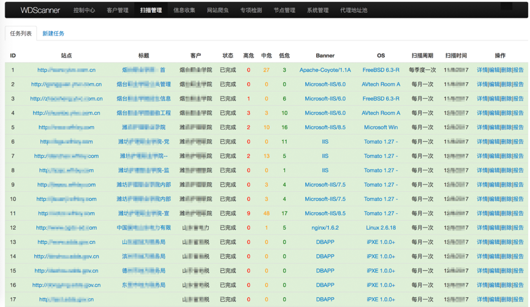

扫描核心库使用了secscanner+w3af+awvs三款工具（secscanner是在建的另一套web扫描器， w3af是最好的开源扫描器），使用较多的扫描工具可能导致扫描速度有所降低，但误报率也会大大降低，扫描时也可选择最实用的扫描策略以节省时间。

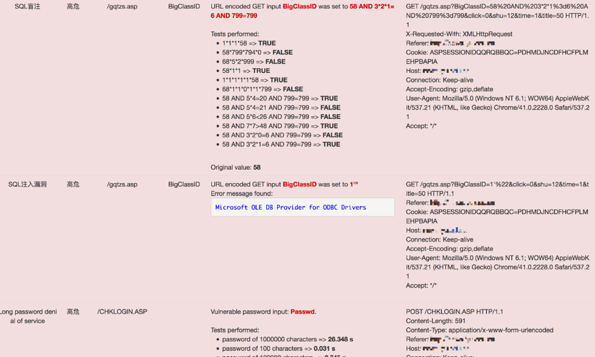

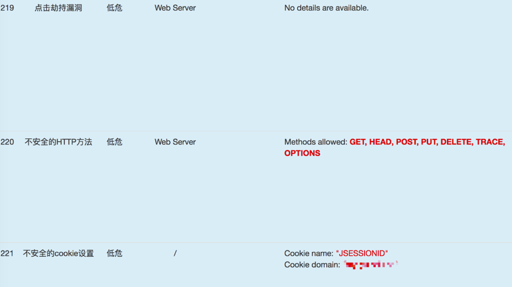


## 2、客户管理
能对客户和资产进行管理，根据客户需求定制化扫描和监测方案，对网站进行定期扫描和网站爬取，检索敏感字、坏链、暗链、信息泄露等威胁，发现风险能及时提醒并告知客户。

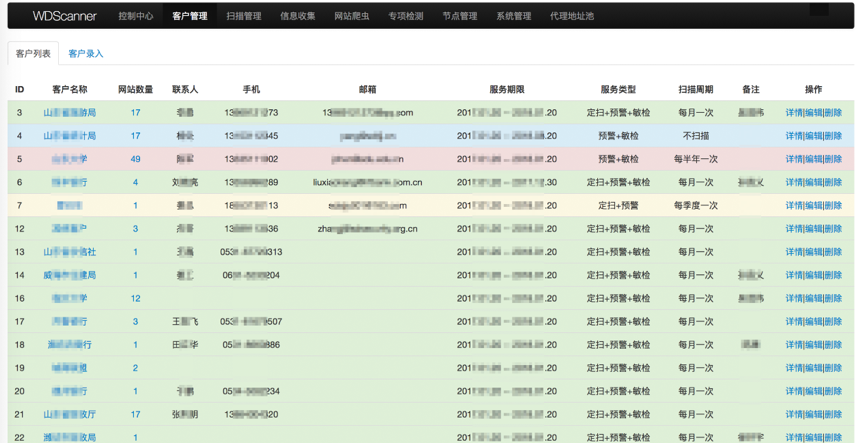

## 3、网站信息收集
在添加新任务后，后台可主动识别目标banner和操作系统信息、端口开放、敏感文件扫描等。

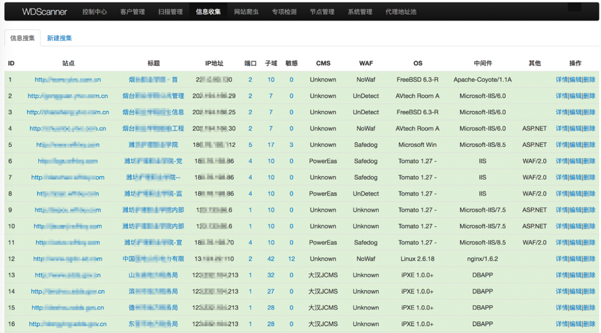


自动识别开发语言、WAF、CMS和中间件等，并对常见端口进行扫描并判断其服务。

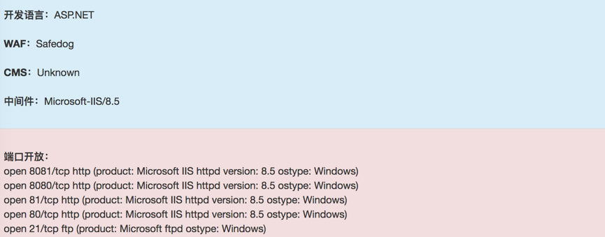

子域名的搜集使用了暴力枚举和互联网检索两种方式，保证了子域名的可用性并缩短了检索时间。


## 4、网站爬虫
目前政府类网站对暗链、敏感字和坏链等内容比较敏感，而网站爬虫可较好的解决这部分需求。

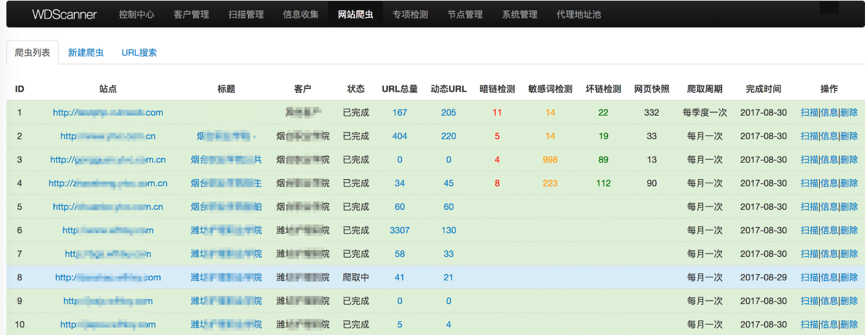

网站爬虫主要是周期性对目标整站页面进行爬取，爬虫算法主要采用了宽度优先遍历策略，可进行网页链接搜集、动态URL搜集、网站敏感字检索、暗链检索、坏链检测、存储网页快照等。

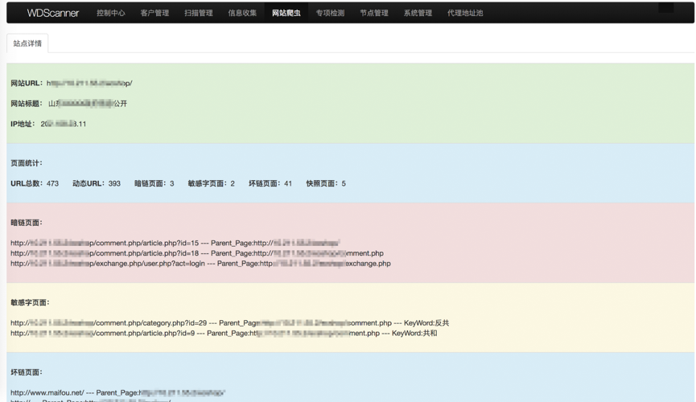


## 5、专项检测
WDScanner集成了专项漏洞检测功能，可在发生高危漏洞时快速部署检测POC，对客户网站进行批量安全性检测。

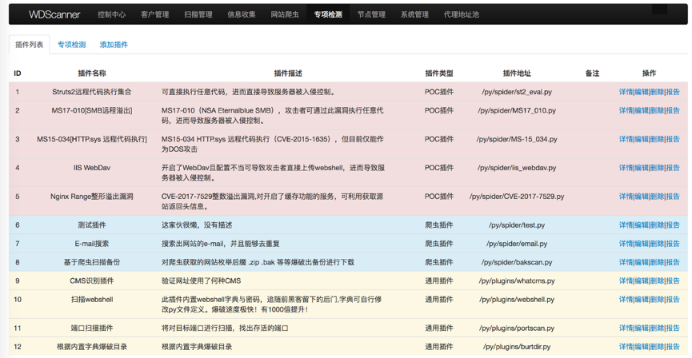


## 6、检索中心
检索中心可使用关键字对漏洞扫描、信息搜集、网站爬虫等进行检索，如漏洞类型、操作系统类型、开放端口、中间件类型、开发技术等。

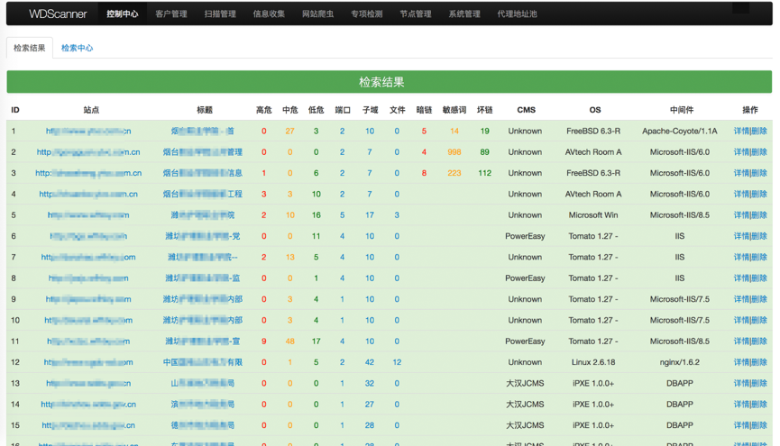


网站URL检索，以检索包含.action的URL为例。

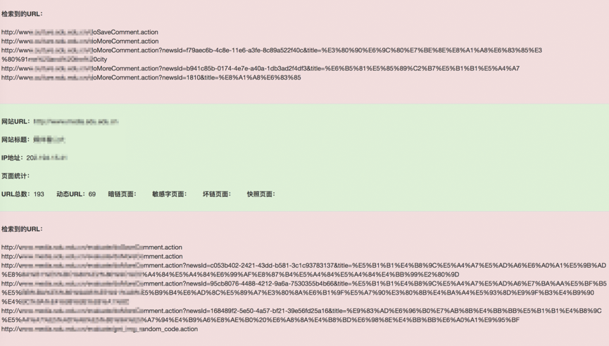

## 7、代理资源池

内置了代理资源池功能，对搜集到的代理地址的可用性进行动态打分排序，可以在扫描探测被封ip时智能切换IP地址。

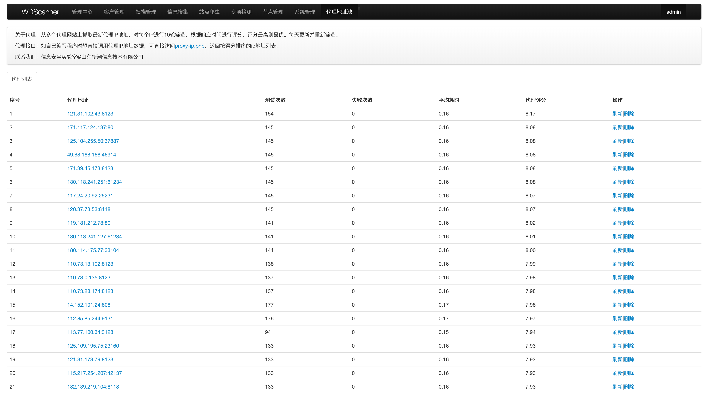

## 8、节点管理

对扫描节点进行管理，不在范围内的节点无法请求平台任务。

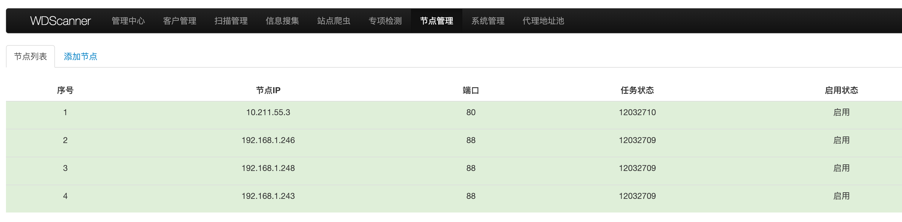

## 8、报告输出

报告输出是专业扫描器不可缺少的部分，看起来功能不是很起眼，但的确花了我们很多时间和精力来实现这个功能。现在还只是实现了一个常规报告模板，而且在漏洞分类里还有些重复，后续还会慢慢完善。

在任务管理里每个任务都可以进行报告导出，大家可以看下报告的大体版式和内容，本想加入图表，暂时没能实现。
生成的报告大体这样。

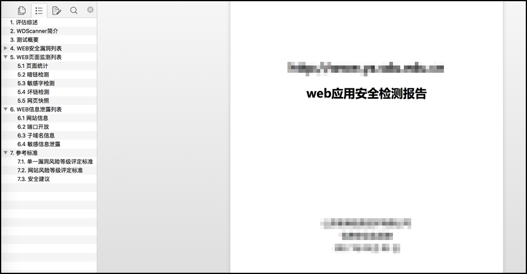

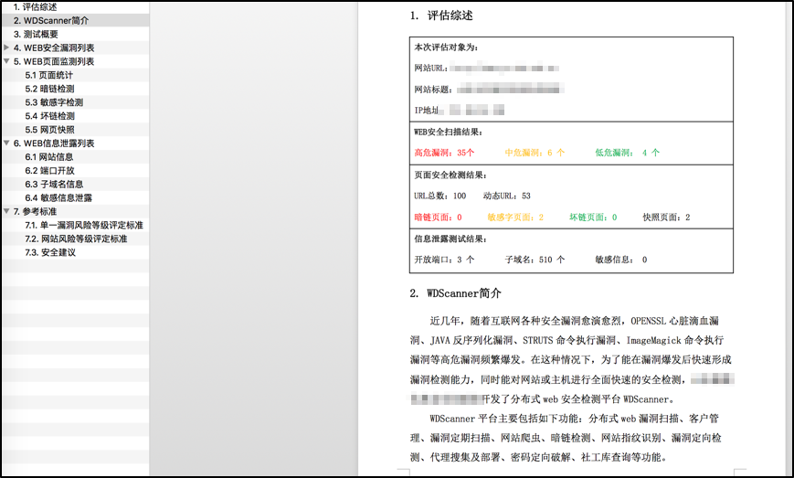


# ToDo

- 前端配色能不那么恶俗


